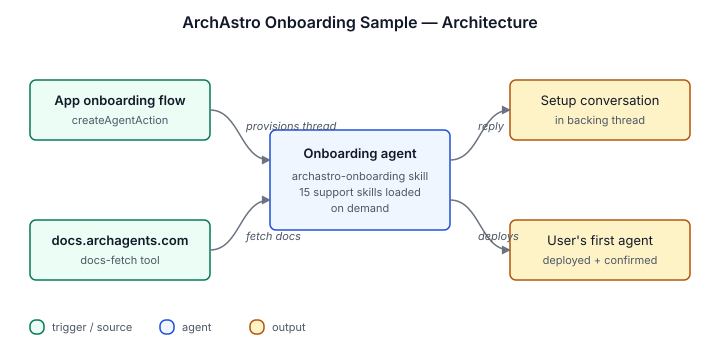

# ArchAstro Onboarding Sample

Guides a new user through setting up their first agent in ArchAstro.

## Architecture



## Install

```sh
archagent install agentsample archastro-onboarding-sample
```

## Bundle layout

- `agents/archastro-onboarding-sample.yaml` — deployable AgentTemplate with custom tools/routines referenced by `template_path`
- `solution.yaml` — catalog Solution wrapper and template manifest
- `tools/` — standalone AgentToolTemplate configs for custom tools
- `env.example` — local reference for required environment variables
- `prompts.md` — bundled sample support files
- `scripts/` — bundled sample support files
- `skills/` — bundled sample support files

## Local validation

```sh
uv run scripts/sample_tool.py generate --check
uv run scripts/sample_tool.py pack solutions/archastro-onboarding-sample
```
