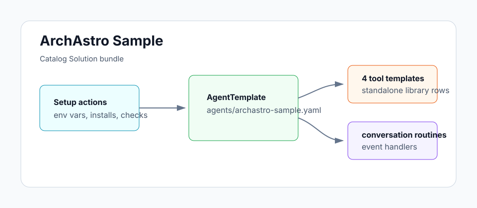

# ArchAstro Sample

The default ArchAstro project concierge.

## Architecture



## Install

```sh
archagent install agentsample archastro-sample
```

## Bundle layout

- `agents/archastro-sample.yaml` — deployable AgentTemplate with custom tools/routines referenced by `template_path`
- `solution.yaml` — catalog Solution wrapper and template manifest
- `tools/` — standalone AgentToolTemplate configs for custom tools
- `env.example` — local reference for required environment variables
- `scripts/` — bundled sample support files

## Local validation

```sh
uv run scripts/sample_tool.py generate --check
uv run scripts/sample_tool.py pack solutions/archastro-sample
```
