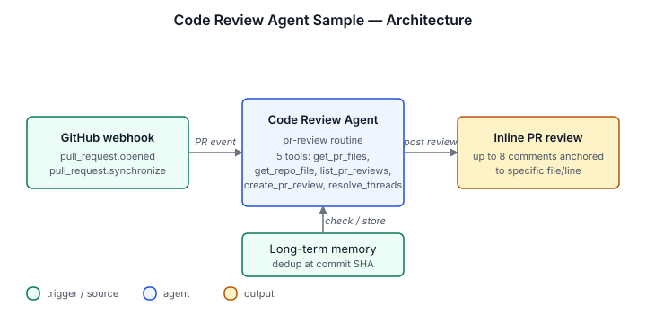

# Code Review Agent Sample

Reviews pull requests on a GitHub App webhook (`pull_request.opened`
and `synchronize`). Reads the diff and the surrounding called code,
force-ranks findings by severity, posts up to 8 inline comments
anchored to specific files and lines, and stays silent when there's
nothing real to flag. Never posts style suggestions or summary
comments.

## Architecture



GitHub PR webhook fires the `pr-review` routine, which checks
long-term memory to skip commits already reviewed at the same SHA,
reads the PR diff via custom scripts, fetches any referenced source
files for context, drafts an inline review, and posts it back to the
PR through the GitHub App identity.

## Install

```sh
archagent install agentsample code-review-agent-sample
```

## Required env vars

| Variable | Required | What it is |
|---|---|---|
| `GITHUB_TOKEN` | Required | Fine-grained PAT (or classic `repo` token) for the sample's custom scripts. Reviews post as this account. Recommended scopes: Contents: read, Pull requests: read/write, Metadata: read. |
| `BOT_LOGIN` | Optional | The PAT account's GitHub username. Enables `resolve_review_threads` for the bot's own threads. Defaults to disabled. |
| `REPO_OWNER` | Optional | Default org for examples and tests. The webhook payload identifies the repo at runtime, so this is a fallback only. |
| `REPO_NAME` | Optional | Default repo, same fallback semantics as `REPO_OWNER`. |

## Bundle layout

- `agents/code-review-agent-sample.yaml` — the agent config
- `solution.yaml` — catalog metadata
- `tools/` — five tool definitions: `get_pr_files`, `get_repo_file`, `list_pr_reviews`, `create_pr_review`, `resolve_review_threads`
- `routines/` — the `pr-review` routine that fires on `webhook.github_app.pull_request`
- `scripts/` — implementations of the five tools
- `examples/` — example PR reviews showing the agent's output format
- `env.example` — required env vars (see above)

## Local validation

```sh
uv run scripts/sample_tool.py generate --check
uv run scripts/sample_tool.py pack solutions/code-review-agent-sample
```
