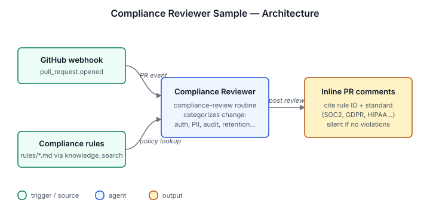

# Compliance Reviewer Sample

Reviews pull requests against your compliance rules — does not review
style or bugs. Loads SOC2/GDPR/HIPAA/internal rules from the knowledge
base, categorizes each change (auth, PII handling, audit logging, data
retention, encryption, access control), and posts inline comments
citing the specific rule and standard. Stays silent when the PR
doesn't touch compliance-relevant code.

## Architecture



GitHub PR webhook fires the `compliance-review` routine. The agent
reads the diff, calls `knowledge_search` against the uploaded
`rules/` corpus to find applicable rules, and posts inline review
comments for any violations — each comment names the rule ID, the
governing standard (e.g. SOC2 CC6.7), and a suggested fix.

## Install

```sh
archagent install agentsample compliance-reviewer-sample
```

## Required env vars

| Variable | Required | What it is |
|---|---|---|
| `GITHUB_TOKEN` | Required | Fine-grained PAT (or classic `repo` token) used by the sample's custom scripts. Review comments post as this account. Recommended scopes: Contents: read, Pull requests: read/write, Metadata: read. |
| `BOT_LOGIN` | Required | The PAT account's GitHub username. Used to dedup the agent's own prior reviews. |

The webhook payload identifies the repo, so `REPO_OWNER`/`REPO_NAME`
are not required.

## Bundle layout

- `agents/compliance-reviewer-sample.yaml` — the agent config
- `solution.yaml` — catalog metadata
- `tools/` — four tool definitions reused from Code Review (`get_pr_files`, `get_repo_file`, `list_pr_reviews`, `create_pr_review`)
- `routines/` — the `compliance-review` routine that fires on `webhook.github_app.pull_request`
- `rules/` — seed compliance rules (Markdown) the agent searches at review time
- `scripts/` — implementations of the four tools
- `examples/` — example compliance violations and the agent's inline comment format
- `env.example` — required env vars (see above)

## Local validation

```sh
uv run scripts/sample_tool.py generate --check
uv run scripts/sample_tool.py pack solutions/compliance-reviewer-sample
```

## Knowledge files

This sample ships seed rules under `rules/*.md`. After installing
the agent, attach these files (and any of your own) as knowledge
sources:

```bash
INSTALLATION=$(archagent list agentinstallations --agent compliance-reviewer-sample -o json \
  | python3 -c "import sys,json; d=json.load(sys.stdin); [print(i['id']) for i in d['data'] if i['kind']=='archastro/files']" | head -1)

for f in rules/*.md; do
  FILE_ID=$(archagent create files \
    --data "$(base64 < "$f")" \
    --filename "$(basename "$f")" --content-type text/markdown \
    | grep -oE 'fil_[A-Za-z0-9]+' | head -1)
  archagent create agentinstallationsources \
    --installation "$INSTALLATION" \
    --type file/document \
    --payload "{\"file_id\": \"$FILE_ID\"}"
done
```
