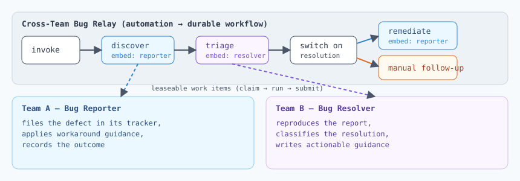

# Cross-Team Bug Relay

A demo of ArchAstro's **distributed durable workflows** — and the first
catalog Solution to ship an **automation**.

One invocable automation relays a discovered defect between two teams'
agents as a single durable workflow run:

```
invoke ─→ discover (Bug Reporter files the issue in its tracker)
       ─→ triage   (Bug Resolver reproduces + classifies)
       ─→ switch on resolution
            ├─ attempt_workaround ─→ remediate (Bug Reporter applies guidance)
            └─ anything else      ─→ manual follow-up notice
```

Status updates post to an optional thread at every stage. Each embedded
stage is a leaseable work item on the named agent's queue — the run
survives restarts, retries, and slow agents, and the whole story is
inspectable in the run's journal.

The shape is modeled on real cross-company bug workflows (discover →
hand off → triage → close the loop) but is deliberately **generic**: no
issue tracker, vendor, or product is assumed. Connect each agent's real
tools at install time.



## Layout

```
cross-team-bug-relay/
  sample.yaml                  # deploy steps (upload workflow, deploy solution)
  solution.yaml                # catalog wrapper + templates list
  agents/
    bug-reporter.yaml/.md      # tracker-side AgentTemplate
    bug-resolver.yaml/.md      # owning-side AgentTemplate
  automations/
    bug-relay.yaml/.md         # invocable org-level AutomationTemplate
  workflows/
    bug-relay.yaml             # the WorkflowGraph (embed nodes + switch + thread posts)
  diagrams/architecture.svg
```

## Try it

1. Validate and package:

   ```sh
   archastro validate solution .
   archastro package solution .
   ```

2. Import + install the three templates (multi-template Solution — pick
   each with `template`). Agents first, then the automation.

3. Invoke a relay (see `automations/bug-relay.md` for the payload
   contract), and drive the embedded stages with each agent's harness:

   ```sh
   archastro list workflow-work --agent <agent>
   archastro claim workflow-work --agent <agent>
   ```

## Cross-org relays

Work items only cross an org boundary when the automation carries an
`assign` ACL grant naming the assignee agent (or its org):

```sh
archastro update automation cross-team-bug-relay \
  --acl-add agent:<resolver-agent-id>:assign
```
