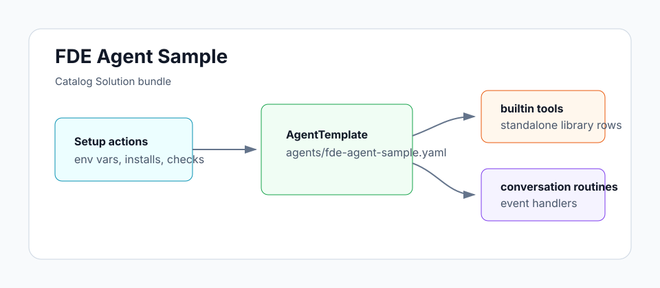

# FDE Agent Sample

A Forward Deployed Engineer agent that runs a discovery → implementation
→ validation → handoff playbook on customer threads. Specialize it by
attaching your project's docs as knowledge sources.

## Architecture



Triggered by direct messages in an FDE thread. The agent loads the
`fde-engagement-playbook` skill on demand, grounds its work in
`knowledge_search` and long-term memory, and produces a phase chain
from discovery through handoff. No webhooks, no cron — sessions are
user-initiated.

## Install

```sh
archagent install agentsample fde-agent-sample
```

## Required env vars

None. Store any required customer secrets through ArchAstro env vars,
not in agent prompts or scripts.

## Bundle layout

- `agents/fde-agent-sample.yaml` — the agent config (builtin tools only; no custom scripts)
- `solution.yaml` — catalog metadata
- `skills/` — the `fde-engagement-playbook` skill the agent loads on demand
- `examples/` — sample first-engagement thread showing the four-phase flow
- `env.example` — no required env vars

## Local validation

```sh
uv run scripts/sample_tool.py generate --check
uv run scripts/sample_tool.py pack solutions/fde-agent-sample
```
