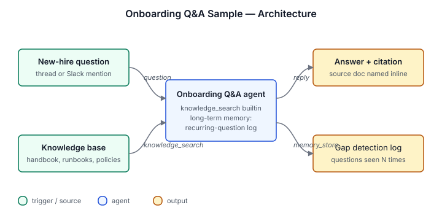

# Onboarding Q&A Sample

Answers new-hire questions from a knowledge base of your uploaded
company docs, runbooks, and policies. Searches semantically via
`knowledge_search`, cites the source doc on every answer, and admits
when it doesn't know. No custom scripts — the agent is a single
`knowledge_search` builtin plus a tuned identity prompt.

## Architecture



Triggered by user messages in a thread (or a Slack channel via the
`slack_bot` integration). The agent calls `knowledge_search` against
the uploaded `knowledge/` corpus and replies in the same thread with
an inline citation. Recurring questions are tracked in long-term
memory so you can see documentation gaps.

## Install

```sh
archagent install agentsample onboarding-qa-sample
```

## Required env vars

| Variable | Required | What it is |
|---|---|---|
| `COMPANY_NAME` | Required | Used in the agent's voice (e.g. "Here's how we do code review at `${COMPANY_NAME}`"). |

No GitHub token, no Slack token. Add `integration/slack_bot` only
if you want Slack delivery.

## Bundle layout

- `agents/onboarding-qa-sample.yaml` — the agent config (all builtin tools, no custom scripts)
- `solution.yaml` — catalog metadata
- `knowledge/` — seed FAQ. Replace with your own onboarding docs (handbook, dev setup, glossary, etc.) using the CLI flow below.
- `examples/` — example new-hire conversation showing the answer + citation format
- `env.example` — required env vars (see above)

## Local validation

```sh
uv run scripts/sample_tool.py generate --check
uv run scripts/sample_tool.py pack solutions/onboarding-qa-sample
```

## Knowledge files

The seed FAQ ships under `knowledge/`. After installing the agent,
attach those files (and any additional onboarding docs) as knowledge
sources:

```bash
INSTALLATION=$(archagent list agentinstallations --agent onboarding-qa-sample -o json \
  | python3 -c "import sys,json; d=json.load(sys.stdin); [print(i['id']) for i in d['data'] if i['kind']=='archastro/files']" | head -1)

for doc in knowledge/*.md /path/to/your/onboarding/*.{pdf,md}; do
  [ -f "$doc" ] || continue
  ct=$(case "$doc" in *.pdf) echo application/pdf ;; *) echo text/markdown ;; esac)
  FILE_ID=$(archagent create files \
    --data "$(base64 < "$doc")" \
    --filename "$(basename "$doc")" --content-type "$ct" \
    | grep -oE 'fil_[A-Za-z0-9]+' | head -1)
  archagent create agentinstallationsources \
    --installation "$INSTALLATION" \
    --type file/document \
    --payload "{\"file_id\": \"$FILE_ID\"}"
done
```
