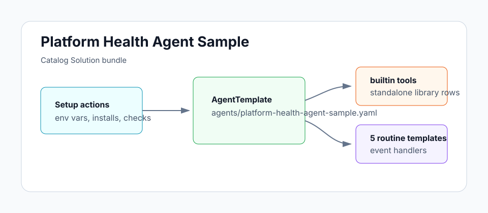

# Platform Health Agent Sample

Daily report on your repo's health, GitHub event alerts, and a 5xx digest from production logs — delivered to Slack.

## Architecture



## Install

```sh
archagent install agentsample platform-health-agent-sample
```

## Bundle layout

- `agents/platform-health-agent-sample.yaml` — deployable AgentTemplate with custom tools/routines referenced by `template_path`
- `solution.yaml` — catalog Solution wrapper and template manifest
- `routines/` — standalone AgentRoutineTemplate configs for substantive routines
- `env.example` — local reference for required environment variables
- `examples/` — bundled sample support files
- `scripts/` — bundled sample support files

## Local validation

```sh
uv run scripts/sample_tool.py generate --check
uv run scripts/sample_tool.py pack solutions/platform-health-agent-sample
```
