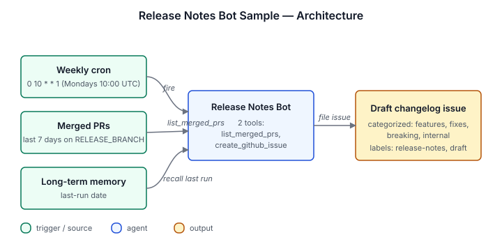

# Release Notes Bot Sample

Drafts a weekly changelog from your merged PRs. Runs on a cron
(default: Mondays at 10:00 UTC), groups changes by category
(Highlights, Features, Fixes, Breaking, Internal), highlights
migrations and deprecations, and files the draft as a GitHub issue
labeled `[release-notes, draft]`.

## Architecture



Weekly cron routine lists merged PRs on `RELEASE_BRANCH` for the
last 7 days via the GitHub REST API, then asks the agent to draft a
categorized changelog from PR titles, bodies, and labels. A second
script files the draft as a GitHub issue. The last-run date is
stored in long-term memory; first run defaults to the last 7 days.

## Install

```sh
archagent install agentsample release-notes-bot-sample
```

## Required env vars

| Variable | Required | What it is |
|---|---|---|
| `GITHUB_TOKEN` | Required | Fine-grained PAT (or classic `repo` token) for the sample's custom scripts. Draft issues post as this account. Recommended scopes: Pull requests: read, Issues: read/write, Metadata: read. |
| `REPO_OWNER` | Required | GitHub org owning the repo being watched. |
| `REPO_NAME` | Required | Repo to watch and where to file the draft issues. |
| `RELEASE_BRANCH` | Required | Branch to track for "merged" PRs (usually `main`). |

## Bundle layout

- `agents/release-notes-bot-sample.yaml` — the agent config
- `solution.yaml` — catalog metadata
- `tools/` — two tool definitions: `list_merged_prs`, `create_github_issue`
- `routines/` — the `weekly-changelog` cron routine (default: `0 10 * * 1`)
- `scripts/` — implementations of the two tools
- `examples/` — `sample-changelog.md` showing the GitHub issue format
- `env.example` — required env vars (see above)

## Local validation

```sh
uv run scripts/sample_tool.py generate --check
uv run scripts/sample_tool.py pack solutions/release-notes-bot-sample
```
