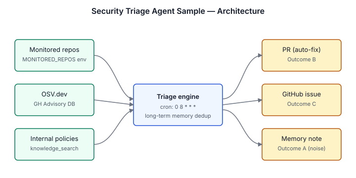
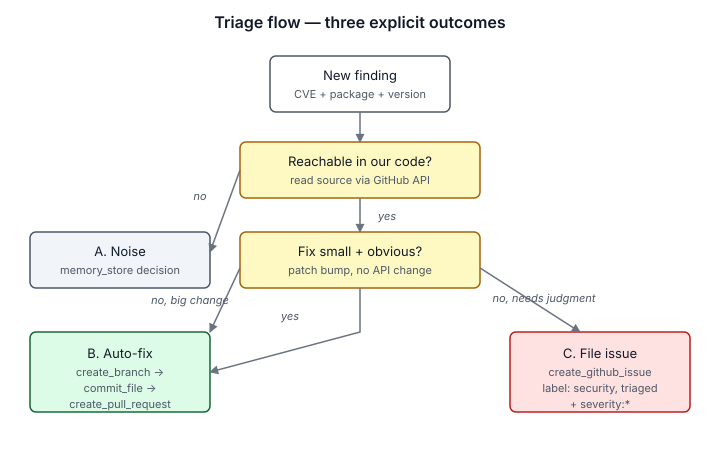

# Security Triage Agent Sample

Runs a daily dependency scan across your monitored repos, queries
OSV.dev and the GitHub Advisory Database for known CVEs, and triages
every finding into one of three explicit outcomes: an auto-fix PR, a
GitHub issue with full reasoning, or a recorded "noise" decision in
long-term memory. Grounds severity and remediation timelines in your
uploaded security policies via `knowledge_search`.

## Architecture



Monitored repos and vulnerability feeds (OSV.dev, GitHub Advisory DB)
fan into a single triage engine, cross-referenced against your internal
security policies via `knowledge_search`. Every finding leaves the
engine through exactly one of three durable outputs.

## What it does

### 1. Daily dependency scan (cron: 08:00 UTC)
- Reads your `mix.lock`, `package-lock.json`, etc. via the GitHub API
- Queries OSV.dev and the GitHub Advisory Database for known vulns
- Cross-references findings against your internal security policies (knowledge base)
- Triages each finding into one of three outcomes (see
  [triage flow](diagrams/triage-flow.svg) below):
  - **A. Already mitigated / noise** → store decision in long-term memory, move on
  - **B. Small targeted fix** → create branch, commit fix, open PR
  - **C. Needs human attention** → file a GitHub issue with full reasoning



### 2. PR security review
- Reacts to GitHub PR webhooks for security-relevant changes
- Reads the diff and flags concerns inline

### 3. Hourly log analysis
- Queries your logging service for auth anomalies, suspicious access,
  permission escalations
- Alerts via Slack on real signals (filters out routine noise)

## What makes the triage different

**The three explicit outcomes force a decision.** No "I'll come back to it later"
in long-term memory where humans can't see it. Every finding ends up in
exactly one place a human can actually look:
- A merged PR (auto-fix worked)
- An open GitHub issue (human attention needed)
- Long-term memory with a clear "noise" decision (won't be re-litigated next scan)

**Knowledge base grounding.** The agent loads your internal security
policies (patch management standard, InfoSec policy, etc.) as knowledge
sources. When triaging, it cites the relevant policy for severity
classification and remediation timelines instead of guessing.

**Dedup against past decisions.** Before triaging, it `memory_recall`s
past decisions on the same package and existing GitHub issues for the
same CVE — so it doesn't re-file the same finding every day.

## Install

```bash
uv run scripts/sample_tool.py pack solutions/security-triage-agent-sample
```

Upload the generated tarball through the catalog. After install, open
the agent in the developer portal and finish setup — fill in the env
vars (below), install the GitHub App and Slack bot when prompted, and
upload your security policies as knowledge sources (next section).

## Install with an AI coding assistant

Paste this into Claude Code, Codex, or any AI coding assistant:

```
Install the Security Triage Agent Sample from this repo.

1) Pack it: uv run scripts/sample_tool.py pack solutions/security-triage-agent-sample
2) Upload the generated tarball through the catalog.
3) Open the agent in the developer portal.
4) Walk me through the "Finish setup" panel: ask for env var values, install integrations on prompt, and confirm each verifier turns green.
```

## Required env vars

| Variable | What it is |
|---|---|
| `GITHUB_TOKEN` | GitHub token used by the sample's custom scripts. PRs and issues post as this account. Prefer a fine-grained PAT with Contents: read/write, Pull requests: read/write, Issues: read/write, and Metadata: read. A classic `repo` token also works but is broader. |
| `DEFAULT_REPO_OWNER` | GitHub org for default scanning |
| `DEFAULT_REPO_NAME` | Default repo to scan |
| `DEFAULT_ECOSYSTEM` | `hex` for Elixir, `npm` for Node, `pip` for Python, etc. |
| `MONITORED_REPOS` | Comma-separated `owner/repo` list to scan |
| `SECURITY_TEAM_EMAIL` | Where to email scan summaries |

Optional:

| Variable | What it is |
|---|---|
| `GCLOUD_PROJECT_ID` | GCP project for log analysis |
| `GCLOUD_SA_KEY` | Service account JSON for read-only log access |

## Knowledge base setup

After installing the agent, upload your security policies as knowledge
sources. The agent searches them during triage and cites the relevant
policy in its decisions.

```bash
INSTALLATION=$(archagent list agentinstallations --agent security-triage-agent-sample -o json \
  | python3 -c "import sys,json; d=json.load(sys.stdin); [print(i['id']) for i in d['data'] if i['kind']=='archastro/files']" | head -1)

for pdf in /path/to/your/policies/*.pdf; do
  FILE_ID=$(archagent create files \
    --data "$(base64 < "$pdf")" \
    --filename "$(basename "$pdf")" --content-type application/pdf \
    | grep -oE 'fil_[A-Za-z0-9]+' | head -1)
  archagent create agentinstallationsources \
    --installation "$INSTALLATION" \
    --type file/document \
    --payload "{\"file_id\": \"$FILE_ID\"}"
done
```

Recommended policies to upload:
- Patch Management Standard (severity → remediation timeline)
- InfoSec Policy
- Endpoint Security Standard
- Data Classification Standard
- Acceptable Use Policy
- Incident Response Plan

## Triage outcomes — examples

### Outcome A: Already mitigated
> CVE-2025-XXXXX in `axios@0.27.2` — vulnerable function is `formToJSON`
> which we don't use. We only call `axios.get` and `axios.post`. No exposure.
> Decision: noise. Stored in memory. Will not re-flag on future scans.

### Outcome B: Auto-fixed
> CVE-2025-YYYYY in `lodash@4.17.20` — prototype pollution in `_.set`.
> We use `_.set` in 3 places, all with literal keys. Per our patch
> management standard (high severity → 7 day SLA), this needs to be fixed.
> Created branch `security/fix-CVE-2025-YYYYY`, committed bump to `4.17.21`.
> PR #1234 opened.

### Outcome C: Filed as issue
> CVE-2025-ZZZZZ in `next@13.5.0` — server actions auth bypass. The fix
> requires upgrading to `15.x`, which is a major version bump that
> touches our middleware setup. Per patch management standard (critical →
> 48 hour SLA), this needs immediate attention but can't be auto-fixed.
> Filed issue #5678 with full triage and recommended upgrade path.

## Customization

### Different ecosystems
The shipped agent parses `hex` (Elixir mix.lock) out of the box. npm
and pip parsers are not yet implemented — the script will return empty
results for those ecosystems. Add a new ecosystem by extending
`scripts/scan_dependencies.aascript` with the matching lockfile parser.

### Different escalation channel
By default, escalations go to GitHub issues. To use Linear or Jira
instead, replace `create_github_issue` with `create_linear_issue` or
`create_jira_issue` (you'd write these as new scripts using their REST APIs).

### Different model
Triage benefits from strong reasoning. Recommended: Claude Sonnet or
Opus. Cheaper models will produce more false positives.

## What this demonstrates

- **Mixed-trigger routines** — daily dependency scan (cron), hourly log analysis (cron), PR review (GitHub webhook)
- **Knowledge sources** — internal policies as searchable context
- **Long-term memory** — past triage decisions persist across scans
- **Custom scripts** — wraps OSV, GitHub Advisories, GCP Logging APIs
- **GitHub App integration** — read code, create branches, open PRs, file issues
- **Slack integration** — log anomaly alerts
- **Multi-routine agent** — one agent, three different schedules

## Files

```
security-triage-agent-sample/
├── README.md
├── sample.yaml                              # install steps
├── solution.yaml                            # catalog metadata
├── agents/
│   ├── security-triage-agent-sample.yaml    # the agent config
│   └── security-triage-agent-sample.md      # in-product README
├── tools/                                   # 9 tool definitions
│   ├── query-osv.{yaml,md}
│   ├── query-github-advisories.{yaml,md}
│   ├── scan-dependencies.{yaml,md}
│   ├── get-repo-file.{yaml,md}
│   ├── create-branch.{yaml,md}
│   ├── commit-file.{yaml,md}
│   ├── create-pull-request.{yaml,md}
│   ├── create-github-issue.{yaml,md}
│   └── query-gcloud-logs.{yaml,md}
├── routines/                                # 3 routines
│   ├── daily-dependency-scan.{yaml,md}
│   ├── hourly-log-analysis.{yaml,md}
│   └── pr-review.{yaml,md}
├── scripts/                                 # tool implementations
│   ├── st-query-osv.aascript
│   ├── st-query-github-advisories.aascript
│   ├── st-scan-dependencies.aascript
│   ├── st-get-repo-file.aascript
│   ├── st-create-branch.aascript
│   ├── st-commit-file.aascript
│   ├── st-create-pull-request.aascript
│   ├── st-create-github-issue.aascript
│   ├── st-query-gcloud-logs.aascript
│   └── st-verify-monitored-repos-access.aascript
├── diagrams/
│   ├── architecture.svg
│   └── triage-flow.svg
├── env.example
├── examples/
│   └── sample-scan.md
└── test/
    └── sample-package.json
```
