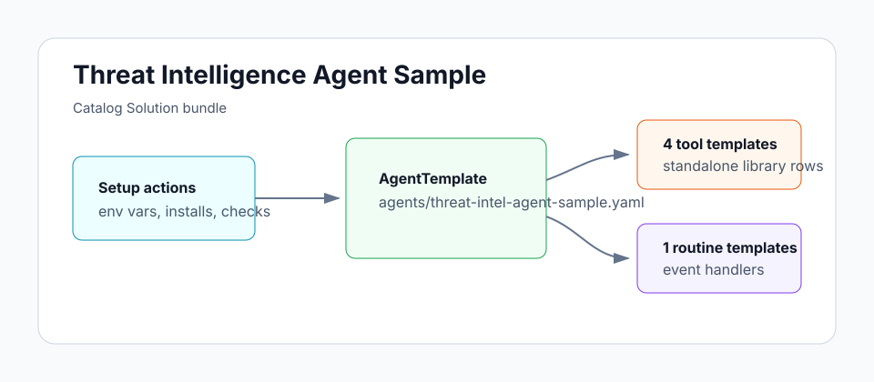

# Threat Intelligence Agent Sample

A daily security brief that filters Hacker News, GitHub Security
Advisories, and CVE feeds against your actual stack. Runs at 07:00
UTC, files exposure issues with `severity:*` labels for any direct
package exposure, and posts a scannable summary to your Slack
security channel.

## Architecture



Daily cron routine fans into three sources: Hacker News via the
Algolia API (filtered by points), GitHub Security Advisories
(filtered by severity and ecosystem), and your `MONITORED_REPOS`
lockfiles. The agent cross-references findings against
`STACK_DESCRIPTION`, dedups against past briefs in long-term
memory, files a brief as a GitHub issue on `BRIEF_REPO`, and posts
a Slack summary to `SLACK_CHANNEL`.

## Install

```sh
archagent install agentsample threat-intel-agent-sample
```

## Required env vars

| Variable | Required | What it is |
|---|---|---|
| `GITHUB_TOKEN` | Required | Fine-grained PAT (or classic `repo` token) for the sample's custom scripts. Issues post as this account. Recommended scopes: Contents: read, Issues: read/write, Metadata: read. |
| `MONITORED_REPOS` | Required | Comma-separated `owner/repo` list whose lockfiles to check for exposure. |
| `STACK_DESCRIPTION` | Required | One-line description of your stack (e.g. `"Elixir/Phoenix backend, Next.js frontend, GCP infra"`). The agent uses this to filter what's relevant. |
| `BRIEF_REPO` | Required | `owner/repo` where the daily brief and per-CVE exposure issues get filed. |
| `SLACK_CHANNEL` | Required | Slack channel for the daily summary (e.g. `#security`). |

The shipped scripts query `hex` and `npm` advisories by default. To
add other ecosystems (`pip`, `RubyGems`, `Maven`), edit the
`daily-threat-brief` routine instructions in `agents/threat-intel-agent-sample.yaml`.

## Bundle layout

- `agents/threat-intel-agent-sample.yaml` — the agent config
- `solution.yaml` — catalog metadata
- `tools/` — four tool definitions: `search_hn_security`, `list_recent_advisories`, `get_repo_file`, `create_github_issue`
- `routines/` — the `daily-threat-brief` cron routine (default: `0 7 * * *`)
- `scripts/` — implementations of the four tools
- `examples/` — `sample-brief.md` showing the GitHub issue and Slack summary formats
- `env.example` — required env vars (see above)

## Local validation

```sh
uv run scripts/sample_tool.py generate --check
uv run scripts/sample_tool.py pack solutions/threat-intel-agent-sample
```
